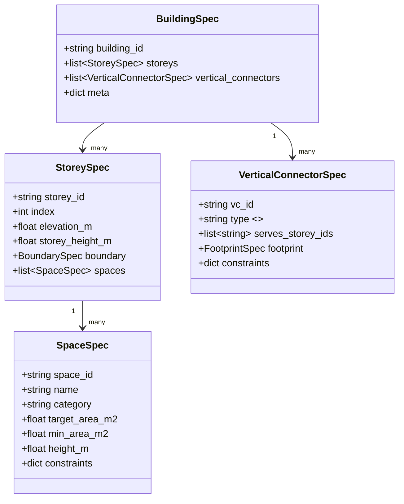

# 多階対応 Topology→Layout→Geometry→IFC パイプライン設計要件書（Python実装）

## エグゼクティブサマリ

本要件書は、**RDFで表現された建物トポロジー（空間階層・隣接・接続・コア/階段/EVなどの階間要素）**から、**複数階（multi-storey）**の平面レイアウトを計算し、**パラメトリックに3D化**したうえで、**IFC4/IFC4X3（IFC4.3系）の空間構造を満たすIFC**として出力するための、Python実装向け設計要件を再定義する。IFCはentity["organization","buildingSMART International","openbim standards body"]が公開・維持するオープン標準であり、建物の空間構造（Project→Site→Building→Storey→Space等）と要素の包含/参照関係（例：IfcRelContainedInSpatialStructure）を持つ。citeturn5search0turn0search2turn5search12turn5search22

複数階対応の核心は、(1) **階層（Building/Storey/Space）**と、(2) **階間接続（Stair/Elevator/Shaftなど）**をトポロジーで明示し、(3) レイアウト最適化を「階ごとの局所最適」だけでなく「階間整合（コアの位置揃え、縦シャフトの重なり、階段の貫通開口など）」まで含めて扱う点にある。RDF側で階層や階段室を表すには、例としてW3C LBD-CGのBOT（Building Topology Ontology）が、Storey/Spaceと、**階段室を複数階に跨るZoneとして表現しStoreyと交差させる**モデリング（bot:intersectsZone）を提示している。citeturn1search9turn0search7turn0search3

レイアウト計算は、制約満足と最適化（面積・隣接・動線・階間整合）を扱うため、entity["company","Google","tech company"]が提供するOR-ToolsのCP-SAT（整数制約最適化）を中核に据える。CP-SATは整数でモデリングする必要があるため、メートル等の連続値はスケーリングして整数化する前提とする。citeturn0search4turn0search0turn0search8

IFC出力はIfcOpenShellのPython API（project.create_file / root.create_entity / aggregate.assign_object / spatial.assign_container / geometry.add_*_representation 等）を利用し、空間分解の階層（IfcRelAggregates）と、要素の包含（IfcRelContainedInSpatialStructure）を正しく張る。多階に跨る要素（例：階段、吹抜け縁の要素、複数階柱など）は、**「包含」ではなく「参照」**を併用する必要がある（IfcOpenShellでも、複数階に跨る要素には spatial.reference_structure を使う旨が説明されている）。citeturn9search0turn0search1turn4search1turn4search11turn4search20turn0search2

---

## 対象範囲と前提

**対象範囲（本書の要件として実装対象）**  
本システムは、入力RDF（Turtle/JSON-LD等）から建物の空間トポロジーを読み込み、複数階のルーム/ゾーン配置を解き、パラメトリックにIFCを生成する。

- **複数階（multi-storey）**：IfcBuildingStoreyを複数生成し、階高（elevation/height）を持ち、階ごとにIfcSpace群を生成する。IfcBuildingStoreyは空間構造の階層要素であり、IfcRelAggregatesで階層構造を形成する。citeturn5search0turn5search7  
- **階間接続**：階段（IfcStair/IfcStairFlight）やエレベータ（IfcTransportElement）等、縦方向移動を表す要素のトポロジーと形状を最小限生成する。citeturn5search6turn5search2turn2search37turn2search9  
- **IFC生成**：空間構造（IfcProject→IfcBuilding→IfcBuildingStorey→IfcSpace）と、要素の包含（IfcRelContainedInSpatialStructure）を生成する。要素は原則「1つの空間構造要素にのみ包含」される。citeturn0search2turn5search12turn2search0  
- **中間成果物**：topology.ttl、layout.json、layout.geojson（可視化用）を出力する（フォーマット要件は後述）。GeoJSONは標準としてRFC 7946があり、座標系はWGS84（経緯度）を前提とするため、建物ローカル座標を載せる場合は「可視化・デバッグ用途の派生」として扱う。citeturn2search3turn2search7turn2search11  

**非対象（明示的にスコープ外）**  
以下は、今回の「実装可能な設計要件書」範囲から外す。

- 法規（避難・採光・容積等）の自動充足証明（**制約なし**：将来拡張は可能だが本要件では必須にしない）
- 構造解析に耐える部材詳細（梁・柱配筋、接合ディテール等）（**制約なし**）
- MEP（ダクト・配管）自動設計（**制約なし**：HVAC用途に拡張しやすいIFC/セマンティクスは考慮するが自動配管は対象外）
- 自由曲面・複雑B-Repを前提とする幾何生成（v1ではSweptSolid中心）
- 既存図面（2D CAD/スキャン）からの認識・復元（**制約なし**：別パイプライン；ただし関連ツール調査は後述）citeturn6search12turn6search15  

**未指定の要件は「制約なし」**  
入力建物種別（住宅/オフィス等）、階数上限、建物外形（矩形/非矩形）、座標系（測地/ローカル）、LOD、材料・属性粒度はユーザ未指定のため、要件としては **制約なし** とし、configで規定可能にする。citeturn9search0turn5search3  

---

## 拡張アーキテクチャ

複数階対応では、単一階の「Topology→Layout→IFC」を、**建物全体（Building）を統括するオーケストレータ**と、**階ごと（Storey）に閉じたサブ問題**へ分解しつつ、**縦方向の整合制約**を共有する設計が実装容易かつスケールしやすい（階数×部屋数で問題が急増するため、全階同時の完全一括最適化は計算量・デバッグ性で不利になりやすい）。

**拡張パイプライン（推奨）**  
（Mermaidは実装者の合意形成とドキュメント同期に有効）

```mermaid
flowchart TB
  A[RDF topology (BOT/Brick/Custom)] --> B[Topology Normalizer]
  B --> C[Building-level Orchestrator]
  C --> D1[Storey Layout Solver (k=1)]
  C --> D2[Storey Layout Solver (k=2)]
  C --> Dn[Storey Layout Solver (k=n)]
  C --> E[Inter-storey Consistency Optimizer]
  E --> F[Parametric Geometry Builder]
  F --> G[IFC Exporter (IfcOpenShell)]
  G --> H[Artifacts: topology.ttl / layout.json / layout.geojson / out.ifc]
```

**階層表現（Building/Storey/Space + Zone）**  
- RDF側：BOTではSite→Building→Storey→SpaceをZone包含として表現し、また階段室はZoneとして複数階Storeyに「交差」させる例を示す。citeturn1search9turn0search7  
- IFC側：IfcBuildingStoreyは空間構造の「階」であり、空間分解（IfcRelAggregates）で階層を形成する。citeturn5search0turn2search20  

**階間接続（inter-storey connections）**  
階間接続は、トポロジーの「縦エッジ」と、幾何の「貫通・連結形状」を同時に要求する。最低限、以下3クラスを導入する。

- **VerticalConnector（縦コネクタ）**：Stair / Elevator / Shaft。  
- **Core（コア）**：VerticalConnector群を束ね、各階で極力同位置に積層される制約を持つ。  
- **Penetration（貫通開口）**：階スラブに対する開口（IfcOpeningElement＋IfcRelVoidsElement 等）。citeturn2search6turn8search0turn2search2  

**コア/階段/エレベータの扱い（要件）**  
- 階段：IfcStairは「階レベル間を移動する垂直通路」であり、部分に分解（StairFlight/踊場等）しても、単一要素として持ってもよい（両方が仕様上可能）。citeturn5search6turn5search10  
- 階段のフライト：IfcStairFlightはIfcStairに集約（IfcRelAggregates）されるのが典型で、0〜2階（または踊場）間を接続すると記述される。citeturn5search2turn5search14  
- エレベータ：IfcTransportElementはエレベータ等の輸送要素を表す。エレベータ固有のプロパティセット例（Pset_TransportElementElevator）も整備されている。citeturn2search37turn2search9  

image_group{"layout":"carousel","aspect_ratio":"16:9","query":["IfcBuildingStorey spatial structure diagram IFC","IfcRelSpaceBoundary diagram IFC","IfcStair IfcStairFlight diagram IFC","Building Topology Ontology BOT diagram"],"num_per_query":1}

**内部データモデル（推奨：階層＋グラフの二重表現）**  
- 階層：BuildingSpec → StoreySpec → SpaceSpec  
- グラフ：同一階の隣接/接続、階間の縦接続（stairs/elevators）、積層制約（stacking）  



**中間成果物フォーマット（要件：後工程の再現性・デバッグ性）**  
GeoJSONはRFC 7946でWGS84経緯度が前提のため、建物ローカル座標で出す場合は「標準準拠の地理データ交換」ではなく「可視化用派生」と明記する。citeturn2search3turn2search11

|成果物|用途|必須度|備考|
|---|---:|---:|---|
|topology.ttl|入力RDFの正規化版|必須|BOT/Brick/独自を正規化（後述）citeturn1search9turn7search7|
|layout.json|階ごとの矩形/多角形、制約違反レポート|必須|本システムの“真の中間表現”|
|layout.geojson|可視化（2D）|推奨|RFC 7946準拠が必要なら測地参照が別途必要citeturn2search3|
|params.json|壁厚/階高/開口等パラメータ|推奨|IFC生成の再現性に寄与|
|out.ifc|最終成果物|必須|IFC4/IFC4X3（configで選択）citeturn9search0|

---

## RDF語彙設計例とマッピング方針

複数階対応では、RDFに「階（storey）」と「階間要素」を表現できることが最重要である。語彙はBOT/BricK/独自のどれでもよいが、内部表現（BuildingSpec等）へ射影できることを要件とする。

**優先する設計方針**  
- 階層（site/building/storey/space）を**明示的に**表現する（BOTはこの設計を中心に据える）。citeturn1search9turn0search7  
- Brickを併用する場合、Brickは主にメタデータ（設備・センサ・HVACゾーン等）に強く、位置（building/floor/room）や関係（hasPart等）も扱う。Brickは床→部屋の分解を hasPart / isPartOf で表すガイドを示している。citeturn7search0turn7search24turn1search11  
- BOTとBrickの整合（アラインメント）は既存議論があり、重複概念をBOTに寄せる方向性が言及される。citeturn7search1turn7search22  

**RDF語彙設計例（BOT）**  
BOTは、Storey/Space、隣接、階段室のモデリングなど、トポロジー中心の最小語彙を提供する。citeturn0search3turn1search9

```turtle
@prefix bot: <https://w3id.org/bot#> .
@prefix ex:  <urn:example#> .

ex:BuildingA a bot:Building ;
  bot:hasStorey ex:S1, ex:S2 .

ex:S1 a bot:Storey ;
  bot:hasSpace ex:Room101, ex:Corridor1 .

ex:S2 a bot:Storey ;
  bot:hasSpace ex:Room201, ex:Corridor2 .

# 隣接（同一階）
ex:Room101 bot:adjacentZone ex:Corridor1 .

# 階段室：Zoneとして複数階に跨らせ、Storeyと交差させる例
ex:StairwellA a bot:Zone ;
  bot:intersectsZone ex:S1, ex:S2 .
```

（上例の「stairwellはZoneとしてStoreyに交差させる」設計は、BOTのドキュメントに示される。）citeturn1search9

**RDF語彙設計例（Brick）**  
BrickはLocation（Building/Floor/Room等）と関係（hasPart等）を定義し、PythonでもBrickモデルを生成できる。citeturn7search0turn7search7turn7search3

```turtle
@prefix brick: <https://brickschema.org/schema/Brick#> .
@prefix ex:    <urn:example#> .

ex:Bldg a brick:Building .
ex:F1   a brick:Floor ; brick:isPartOf ex:Bldg .
ex:R101 a brick:Room  ; brick:isPartOf ex:F1 .
```

（Brickの関係設計ガイドは「Floor hasPart Room」などの用法を明示する。）citeturn7search0

**独自語彙（最小要件）**  
BOT/Brickを使わない場合でも、内部モデルへ射影可能であるために最低限次を持つ（これ以外は**制約なし**）。

- `ex:Storey`（階）、`ex:Space`（空間）、`ex:VerticalConnector`（階段/EV等）  
- 階層：`ex:hasStorey`、`ex:hasSpace`  
- 同一階の関係：`ex:adjacentTo`、`ex:connectedTo`（door等）  
- 階間：`ex:connectsStorey`、`ex:servesStorey`  
- 形状条件（任意）：ターゲット面積、最小面積、階高、壁厚などはdatatype propertyで良い（**制約なし**）

**RDFロードと正規化の実装要件**  
- rdflibでTurtle/JSON-LD等を読み込み、SPARQLで／またはトリプル走査で必要情報を抽出する。rdflibはSPARQLクエリの準備（prepareQuery）等を提供する。citeturn3search1  
- 正規化出力（topology.ttl）は、入力語彙が混在しても内部表現が一意になるように、BOT準拠の正規化（推奨）または独自正規化語彙へ落とす。BOTはStorey/Space等を中心にした最小語彙であるため、正規化のハブとして扱いやすい。citeturn0search3turn0search7  

---

## レイアウトアルゴリズム比較と複数階制約設計

### アルゴリズム比較（複数階に拡張する観点）

複数階で難しくなるのは、(a) **階ごとの満足**（面積・隣接・非重なり）に加えて、(b) **階間整合**（コア積層・縦動線・シャフト位置）を同時に満たす必要がある点である。したがってアルゴリズム評価軸は「単一階の生成品質」だけでなく「階間整合の織り込み方（同時最適化か、分解統治か）」になる。

|方式|概観|強み|弱み|複数階適性|
|---|---|---|---|---|
|矩形パッキング（単純ヒューリスティック）|部屋を矩形で逐次配置|高速・実装容易|隣接/階間整合が後付けになりがち|中（後工程必須）|
|CP-SAT矩形配置（NoOverlap2D + 制約）|整数制約で矩形を最適化|制約を明示化できる、再現性を持たせやすい|モデル設計が難しい、巨大化すると重い|高（推奨）|
|階層化配置（コア→各階→全体微調整）|分解統治で問題を小さく解く|スケールしやすい、デバッグ容易|最適性は保証しにくい（ただし実務向き）|非常に高（推奨）|
|トップダウン（建物ボリューム→各階断面）|3Dボリュームを切って各階を得る|multi-storeyを自然に含む|建物外形/ボリュームが必要|条件付き（入力次第）|

（トップダウンのmulti-storey生成例として、建物ボリュームから複数階平面を生成する研究が報告されている。）citeturn6search24

### 推奨レイアウト戦略（実装容易性・拡張性重視）

**推奨：階層化 + CP-SAT（ハイブリッド）**  
1) **Building-level（共通変数）**：コア（階段/EV/シャフト）フットプリントを全階で共有する（または誤差許容で一致させる）  
2) **Storey-level（階ごとのサブ問題）**：部屋矩形をCP-SATで配置（非重なり + 面積 + 隣接）  
3) **Inter-storey refinement**：階間整合（縦コネクタ位置、積層条件）を目的関数ペナルティとして微調整

この方針は、CP-SATの「整数のみ」前提を踏まえ、**長さをmm等へスケールして整数化**する設計と整合する。citeturn0search4turn0search0

### CP-SATモデル設計（要件としての“必須制約”）

CP-SATは整数制約であり、時間制限の設定を推奨している。citeturn0search4turn0search20  
以下は必要最小限の制約セット（未指定の詳細は**制約なし**）。

**変数（整数スケール）**  
- 各階k、各空間i：`x[i,k], y[i,k], w[i,k], h[i,k]`（mm単位のIntVar）  
- 目的関数用：面積誤差、階間ズレ量、隣接成立フラグ など

**必須制約（単一階）**  
- **境界内**：`x>=0, y>=0, x+w<=W_k, y+h<=H_k`（W_k,H_kは階外形の矩形近似、または外形を矩形に制約する；非矩形は拡張）  
- **非重なり**：AddNoOverlap2D（各矩形をインターバルにして衝突を禁止）  
- **面積下限/目標**：`w*h >= min_area`、`|w*h - target_area|`のペナルティ最小化  
（CP-SATには積の等式制約（AddMultiplicationEquality等）が用意される。citeturn3search24turn3search18）

**必須制約（階間）**  
- **コア積層**：VerticalConnectorのフットプリント（`x_core,y_core,w_core,h_core`）を階間で一致、または `|Δx|,|Δy|<=tol` で拘束  
- **貫通領域の整合**：階段/EVシャフトの開口は上下階のスラブで同一位置（または包含関係が矛盾しない）  
- **縦接続の成立**：階段は「上下階を結ぶ」ため、少なくとも連続する2階に渡って存在し、接続先の空間（例：踊場/廊下）に接する（接触制約）

**目的関数（推奨：加重和）**  
- 面積誤差総和（全階）  
- 隣接/接続違反の最小化（違反はスラック変数で許容し、レポート可能に）  
- 階間ズレ最小化（コア位置、縦要素のフットプリント）  
- コンパクトネス（外形の周長/面積比など）  
- 動線（廊下から各室への接続距離を近似的に短く）

「制約が矛盾する場合は最良努力の近似解」を返すには、違反をスラック化して目的関数へ入れる設計が有効である（これにより“解なし”を回避し、違反理由を出力できる）。時間制限設定も必須にする。citeturn0search20turn0search4

---

## 2D→3DパラメトリックルールとIFC生成パターン

### 2D→3Dパラメトリック生成ルール（multi-storey）

2Dレイアウト（各階の矩形/ポリゴン）を、階の標高（elevation）と階高（storey height）を用いて3D化する。Shapelyは平面（Cartesian plane）上の幾何操作を提供するため、2D整形・ポリゴン演算に用いる。citeturn3search5turn3search2

**共通パラメータ（configで指定、未指定はデフォルト）**  
- `wall_thickness_m`、`wall_height_m`、`slab_thickness_m`  
- `storey_height_m`（階ごとに指定可能）  
- `door_width_m`、`door_height_m`  
- `stair_width_m`、`riser_m`、`tread_m`（階段）  
未指定項目は要求通り **制約なし** とし、デフォルト値をconfigで与える。

**壁（IfcWall）**  
- 各階の空間外周・間仕切りを線分集合として抽出し、壁芯/壁厚オフセットを生成  
- 幾何は基本SweptSolid（押し出し）で、IfcOpenShellの `geometry.add_wall_representation` を使うと「壁の代表的な押し出し形状」を簡便に作成できる。citeturn9search23turn8search1turn8search5  

**床スラブ（IfcSlab）**  
- 各階に床（FLOOR）スラブを生成（階段/EVの貫通は開口で抜く）  
- IfcOpenShellには `geometry.add_slab_representation` があり、ポリラインおよびクリッピング指定を受ける。citeturn9search3  

**開口（IfcOpeningElement + IfcRelVoidsElement）と扉（IfcDoor + IfcRelFillsElement）**  
IFCの標準的表現では、  
1) 壁に開口（opening）を作る：IfcRelVoidsElement（壁 ↔ 開口）  
2) 開口に扉を入れる：IfcRelFillsElement（開口 ↔ 扉）  
という二段階で表現される。IfcRelVoidsElementは「要素に空隙を作る」1対1関係で、形状的にはブーリアン減算を含意する。citeturn2search2turn8search0turn2search6  

**階段（IfcStair / IfcStairFlight）**  
- IfcStairは「階レベルを移動する垂直通路」で、部品（フライト、踊場）を集約して表現するか、単体として表現できる。citeturn5search6turn5search10  
- IfcStairFlightは単一の“run”で、通常IfcStairに集約され、0〜2つの階（または踊場）間を接続する。citeturn5search2turn2search1  
- 実装簡略化（推奨）：v1では「階段室（stairwell）の空間」と「貫通開口」と「簡易ソリッド（箱形フライト）」に限定し、詳細段形状は**制約なし（任意）**とする。

**エレベータ（IfcTransportElement）**  
- IfcTransportElementはエレベータ等を含む輸送要素を表す。citeturn2search37turn2search21  
- 必要ならPset_TransportElementElevator等のプロパティセットを付与する。citeturn2search9  
- v1では、シャフト（開口）＋EVケージ（単純箱）までを対象とし、詳細機器は**制約なし**。

### IFC生成パターン（multi-storeyの要点）

**空間構造（IfcBuildingStoreyの扱い）**  
IfcBuildingStoreyは空間構造の階層要素であり、IfcRelAggregatesで階層分解を形成する。citeturn5search0turn2search20  

**IfcBuildingStoreyの階高・標高の扱い（重要）**  
IFC4.3系では、IfcBuildingStoreyのElevation属性が「情報目的のみ」で、さらに非推奨（deprecated）である旨が明記されているため、実装では **ObjectPlacement（IfcLocalPlacement）** でZ座標を表現することを要件とする。citeturn5search3turn5search19turn5search7  

**IfcSpaceの階属性**  
IfcSpaceは空間構造を形成する要素で、Storey配下に集約される（IfcRelAggregates等）。citeturn2search24turn2search0  

**要素の包含（IfcRelContainedInSpatialStructure）**  
IfcRelContainedInSpatialStructureは、要素を空間構造のレベルに割り当てる関係で、要素はあるレベルに一度だけ包含される（主包含）。citeturn0search2turn5search12  

**多階に跨る要素（階段・縦シャフト・複数階要素）の扱い**  
包含が「単一の空間構造にしか紐付けられない」場合、追加の関係として **空間参照（IfcRelReferencedInSpatialStructure）** を併用するのが合理的である。IfcOpenShellの spatial.reference_structure は、複数階に跨る柱や階段などに対して、包含ではなく参照を使うべき例を明示している。citeturn4search20turn0search18  

**空間境界（IfcRelSpaceBoundary）**（任意だがHVAC/熱計算に重要）  
IfcRelSpaceBoundaryは「空間を境界付ける要素（壁等）と空間の関係」をオブジェクト化する。1st/2ndレベル境界（熱的に必要な粒度）も仕様上定義されている。HVAC/エネルギー用途では、将来拡張ポイントとして必ず設計に残す。citeturn5search1turn5search9turn5search31  

**IfcOpenShell API利用方針（実装要件）**  
- 新規IFCファイル作成：`project.create_file`（IFC2X3/IFC4/IFC4X3から選択）citeturn9search0  
- ルート生成：`root.create_entity`（IfcProject等は必須）citeturn0search1  
- 空間階層：`aggregate.assign_object`（空間分解の階層ツリー）citeturn4search1  
- 要素の階への配置：`spatial.assign_container`（壁等をStoreyへ包含）citeturn4search11turn4search7  
- 多階要素：`spatial.reference_structure`を検討（多階要素や両側空間を持つ要素などに適用可能という説明）citeturn4search20  
- 幾何：`geometry.add_wall_representation` / `geometry.add_slab_representation` / `geometry.assign_representation` 等citeturn8search1turn9search3turn8search2turn8search5  
- 任意形状押し出し：ShapeBuilderの `extrude` はIfcExtrudedAreaSolidを生成する。citeturn4search3  

---

## 非機能要件・テストと受入基準・既存研究/ツール調査

### 非機能要件（性能・再現性・スケーラビリティ）

**性能目標（目標値；未指定のため制約なしの範囲で設定）**  
- 典型：階数 3〜10、1階あたり空間 15〜60、合計空間 50〜300 を想定（これ以上は**制約なし**）  
- CP-SATは時間制限を推奨しているため、`time_limit_sec` は必須設定とし、制限時間内で最良解を返す設計とする。citeturn0search20turn0search4  

**再現性**  
- 入力トポロジーとconfigが同一なら、同一seedで同一（または統計的に安定）なlayout.jsonを得る。  
- 並列探索は非決定性を増やす場合があるため、再現性優先モード（例：ワーカー数固定）をconfigで選択可能にする（未指定なので**制約なし**）。

**スケーラビリティ**  
- 階層化配置（コア固定→階別解→全体微調整）により、全階一括モデルの巨大化を抑制する。  
- 各階サブ問題を並列に解くことも可能（ただし再現性モードでは単一スレッド推奨；未指定なので**制約なし**）。

### テストケース（単体・結合・E2E）と受入基準

**単体テスト（UT）**  
- RDF→内部表現：  
  - storey/spaceの抽出が正しい  
  - 未参照ID、循環階層、欠損面積等の入力検証  
  BOT/BricKの基本階層概念は仕様・ドキュメントに基づき検証する。citeturn1search9turn7search0turn0search7  
- 2D幾何：shapelyで生成したポリゴンが妥当（自己交差なし、面積正）citeturn3search5turn3search2  
- CP-SAT：  
  - 非重なり成立（NoOverlap2D）  
  - 時間制限で終了し解を返す（最良努力）citeturn0search20turn3search24  

**結合テスト（IT）**  
- 2階（S1,S2）＋階段室（stairwell zone）＋廊下接続のfixtureで、階間整合（階段フットプリント一致）を満たす  
- 多階要素の参照（reference_structure）を使う場合、包含と参照の整合が取れる（主包含は1つ、参照は複数可という設計意図）citeturn0search2turn4search20  

**E2Eテスト（最小）**  
- out.ifc をIfcOpenShellで再ロードでき、storey数・space数・wall/slab数が期待どおり  
- 空間構造（IfcRelAggregates）と要素包含（IfcRelContainedInSpatialStructure）が生成されるciteturn4search1turn0search2turn5search0  

**受入基準（Acceptance）**  
- 入力RDFのSpace/StoreyがすべてIFCに対応付く（欠損は許容しない）  
- 各階で重なりゼロ、面積下限を満たす（満たせない場合は違反レポートが出る）  
- 階間コア要素（階段/EV/シャフト）は階間で整合（同一座標または許容誤差内）  
- IFCが一般的なビューアで表示され、階構造が閲覧できる（ビューア依存部は**制約なし**だが、IFC仕様の空間構造準拠は必須）citeturn5search0turn0search2turn5search3  

### 既存研究・ツール調査（代表例と短評）

複数階対応の設計上、「トポロジー（グラフ）→平面（矩形/ベクタ）→3D/IFC」への接続が論点となるため、代表研究を“入力表現”と“出力表現”の観点で整理する。

|分類|名称|短評（設計への示唆）|
|---|---|---|
|トポロジー語彙|BOT論文|Storey/Space/Zoneを中心に最小語彙で建物トポロジーを表現し、他オントロジーとの併用を想定。multi-storeyの基盤に向く。citeturn0search7turn0search3|
|トポロジー語彙|BOTドキュメント|階段室をZoneとして複数Storeyに交差させる例を提示。階間接続のRDF表現に具体性がある。citeturn1search9|
|メタデータ語彙|Brick（論文/公式docs）|設備・センサ/ゾーン中心。Location（Building/Floor/Room）と関係（hasPart等）を扱える。BOTと併用し、空間トポロジーをBOTへ寄せる設計が現実的。citeturn7search24turn7search0turn1search11|
|単一階生成|Graph2Plan|「レイアウトグラフ→平面生成」の代表。グラフ制約→配置という思想は本要件（RDF topology→Layout solver）に近い。multi-storeyは別途拡張が必要。citeturn6search1turn6search7|
|単一階生成|House-GAN / House-GAN++|隣接グラフから部屋矩形等を生成する。House-GAN++では改良・反復的精緻化の枠組み。実務では最終解は制約ソルバで確定する設計が安定。citeturn6search5turn6search2|
|単一階生成|Graph Beta Diffusion（東大系）|グラフ表現→平面生成の拡散モデル例。AIは“初期案生成”として利用し、制約で確定する設計に組み込みやすい。citeturn6search11|
|multi-storey研究|Multi-Story Floor Plan Generation（ボリューム→各階）|multi-storeyをトップダウンに生成する研究例。建物外形/ボリュームが入力にある場合の代替戦略として参考。citeturn6search24|
|multi-storeyデータ|BuildingBRep-11K|複数階のB-Repと階別メタデータを含むデータセット。品質フィルタやルール生成の考え方が、ルールベース幾何生成の設計に示唆。citeturn1academia37|
|2D→BIM実装例|Plans2BIM（buildingSMART紹介資料）|2D図面→IFC等の商用実装例。今回の「RDF→IFC」とは入力が異なるが、要素（壁・ドア・スラブ等）生成のスコープ感の参考になる。citeturn6search12|
|IFC実装|IfcOpenShell公式docs/日本語実装記事|PythonでIFCを生成するAPI群（create_file, assign_container等）が整備。日本語から入るなら国内記事も有用。citeturn9search7turn4search11turn9search8|

（国内一次資料の位置づけとして、entity["organization","buildingSMART Japan","japan chapter"]によるIFC解説資料や、entity["organization","国土交通省","japan transport ministry"]のIFC対応要件文書は、IFCが国際標準・交換形式として扱われる前提整理に有用。）citeturn0search10turn5search22  
（また、entity["organization","国土交通省 PLATEAU","japan 3d city model program"]関連ドキュメントでは、IDM/MVD等buildingSMARTの枠組み参照が明示され、交換要件策定プロセスの参考になる。）citeturn2search13  

---

## 実装用アーティファクト

以下は「そのまま実装に着手できる」ことを優先した具体物である。コードは最小E2Eを意図し、プロダクション利用では例外処理・ログ・検証を追加する（未指定のため**制約なし**）。

### config.yaml 例

```yaml
project:
  name: "Topo2IFC Multi-Storey"
  seed: 42
  units:
    length: "m"
    area: "m2"
  # 未指定要件は制約なし：ここで明示的にデフォルトを置く
  defaults:
    storey_height_m: 3.0
    space_height_m: 2.8
    wall_thickness_m: 0.15
    slab_thickness_m: 0.20
    door_width_m: 0.90
    door_height_m: 2.00

io:
  input_topology_path: "topology.ttl"
  output_dir: "out/"
  outputs:
    normalized_topology_ttl: true
    layout_json: true
    layout_geojson: true   # RFC7946準拠が必要なら測地座標化が別途必要
    ifc: true

rdf:
  # BOT / Brick / Custom のうち、先に一致したマッピングを採用
  mapping_priority: ["BOT", "BRICK", "CUSTOM"]
  namespaces:
    bot: "https://w3id.org/bot#"
    brick: "https://brickschema.org/schema/Brick#"
    ex: "urn:example#"
  # SPARQL抽出の基本方針（実装側でクエリを持つ）
  use_sparql: true

layout:
  solver: "cp_sat_hierarchical"   # cp_sat_joint | heuristic | cp_sat_hierarchical
  scale:
    length_unit_to_int: 1000      # m -> mm
  time_limit_sec: 30
  objective_weights:
    area_error: 10
    adjacency_violation: 50
    inter_storey_core_misalignment: 100
    compactness: 1
  building_envelope:
    # 未指定要件は制約なし：矩形外形に落とすか、階ごとの境界を入れるか選べる
    mode: "rect"                   # rect | per_storey_polygon
    rect_width_m: 30
    rect_height_m: 18
  core:
    enable: true
    footprint_m:
      width: 6
      height: 8
    alignment:
      mode: "hard"                 # hard | soft
      tolerance_m: 0.10

geometry:
  mode: "extrusion"
  stair:
    enable: true
    width_m: 1.2
    riser_m: 0.18
    tread_m: 0.28
    lod: "box"                     # box | simplified_steps (未指定: 制約なし)
  elevator:
    enable: true
    car_clear_width_m: 1.1
    car_clear_depth_m: 1.4

ifc:
  schema_version: "IFC4"           # IFC2X3 | IFC4 | IFC4X3
  create_space_boundaries: false   # HVAC用途なら将来 true 推奨
  placement:
    storey_use_objectplacement_z: true
  psets:
    add_basic_quantities: true
```

### OR-Tools CP-SAT モデルひな形コード（多階 + コア積層）

```python
from __future__ import annotations

from dataclasses import dataclass
from typing import Dict, List, Tuple, Optional
from ortools.sat.python import cp_model


@dataclass(frozen=True)
class SpaceReq:
    space_id: str
    storey_id: str
    target_area_m2: Optional[float] = None
    min_area_m2: Optional[float] = None


@dataclass(frozen=True)
class StoreyReq:
    storey_id: str
    width_m: float
    height_m: float


@dataclass(frozen=True)
class CoreReq:
    enabled: bool
    width_m: float
    height_m: float
    tolerance_m: float = 0.0  # hard alignment: 0


@dataclass
class LayoutSolution:
    # space_id -> (x_m, y_m, w_m, h_m)
    rects: Dict[str, Tuple[float, float, float, float]]
    objective_value: float


def solve_multistorey_layout(
    storeys: List[StoreyReq],
    spaces: List[SpaceReq],
    core: CoreReq,
    scale: int = 1000,           # m -> mm
    time_limit_sec: float = 30.0,
) -> LayoutSolution:
    """
    多階（multi-storey）対応の最小CP-SATひな形。
    - 各階で矩形配置 + NoOverlap2D
    - （任意）コアの積層（全階同一位置）を拘束
    """
    model = cp_model.CpModel()

    # 変換
    storey_wh = {
        s.storey_id: (int(round(s.width_m * scale)), int(round(s.height_m * scale)))
        for s in storeys
    }

    # 変数: 空間矩形 (x,y,w,h) と interval
    x: Dict[str, cp_model.IntVar] = {}
    y: Dict[str, cp_model.IntVar] = {}
    w: Dict[str, cp_model.IntVar] = {}
    h: Dict[str, cp_model.IntVar] = {}
    x_intv: Dict[str, cp_model.IntervalVar] = {}
    y_intv: Dict[str, cp_model.IntervalVar] = {}

    # 簡易な幅/高さの範囲（要件に合わせて調整）
    MIN_W = int(2.0 * scale)
    MIN_H = int(2.0 * scale)

    for sp in spaces:
        Wk, Hk = storey_wh[sp.storey_id]
        x[sp.space_id] = model.NewIntVar(0, Wk, f"x_{sp.space_id}")
        y[sp.space_id] = model.NewIntVar(0, Hk, f"y_{sp.space_id}")
        w[sp.space_id] = model.NewIntVar(MIN_W, Wk, f"w_{sp.space_id}")
        h[sp.space_id] = model.NewIntVar(MIN_H, Hk, f"h_{sp.space_id}")

        # 境界内: x+w <= W, y+h <= H
        model.Add(x[sp.space_id] + w[sp.space_id] <= Wk)
        model.Add(y[sp.space_id] + h[sp.space_id] <= Hk)

        # interval（NoOverlap2D用）
        x_intv[sp.space_id] = model.NewIntervalVar(
            x[sp.space_id], w[sp.space_id], x[sp.space_id] + w[sp.space_id], f"xI_{sp.space_id}"
        )
        y_intv[sp.space_id] = model.NewIntervalVar(
            y[sp.space_id], h[sp.space_id], y[sp.space_id] + h[sp.space_id], f"yI_{sp.space_id}"
        )

    # NoOverlap2D（階ごとに分ける）
    for st in storeys:
        st_spaces = [sp.space_id for sp in spaces if sp.storey_id == st.storey_id]
        model.AddNoOverlap2D(
            [x_intv[sid] for sid in st_spaces],
            [y_intv[sid] for sid in st_spaces],
        )

    # コア（全階で同一位置の矩形を確保する最小モデル）
    # ここでは「コア領域を“空間の一つ”として確保」する簡易形にしている。
    if core.enabled:
        core_w = int(round(core.width_m * scale))
        core_h = int(round(core.height_m * scale))
        tol = int(round(core.tolerance_m * scale))

        # 共通コア位置（building-level shared variables）
        # hard alignmentなら tol=0
        core_x = model.NewIntVar(0, max(s.width_m for s in storeys) * scale, "core_x")
        core_y = model.NewIntVar(0, max(s.height_m for s in storeys) * scale, "core_y")

        for st in storeys:
            Wk, Hk = storey_wh[st.storey_id]
            # 各階でコアが境界内
            model.Add(core_x + core_w <= Wk)
            model.Add(core_y + core_h <= Hk)

            # 各階のNoOverlap2Dにコアを追加したい場合は、
            # 追加のIntervalVarを作って同じAddNoOverlap2Dへ入れる。
            # ただしここでは簡略化し、コアと空間の重なりを禁止する制約は省略（要件に応じて追加）。

        # soft alignmentを入れるなら、階ごとのcore_xk/core_ykを作って |Δ|<=tol を課す、等。

    # 目的関数（面積誤差の最小化を例示）
    penalties: List[cp_model.IntVar] = []
    for sp in spaces:
        sid = sp.space_id
        if sp.target_area_m2 is None and sp.min_area_m2 is None:
            continue

        area = model.NewIntVar(0, 10**12, f"area_{sid}")
        model.AddMultiplicationEquality(area, [w[sid], h[sid]])

        if sp.min_area_m2 is not None:
            min_area = int(round(sp.min_area_m2 * (scale * scale)))
            model.Add(area >= min_area)

        if sp.target_area_m2 is not None:
            target_area = int(round(sp.target_area_m2 * (scale * scale)))
            diff = model.NewIntVar(0, 10**12, f"diff_{sid}")
            model.AddAbsEquality(diff, area - target_area)
            penalties.append(diff)

    if penalties:
        model.Minimize(sum(penalties))
    else:
        model.Minimize(0)

    solver = cp_model.CpSolver()
    solver.parameters.max_time_in_seconds = time_limit_sec
    # 再現性優先ならワーカー数固定などをここで設定（要件に応じて）

    status = solver.Solve(model)
    if status not in (cp_model.OPTIMAL, cp_model.FEASIBLE):
        raise RuntimeError(f"No solution found. status={status}")

    rects: Dict[str, Tuple[float, float, float, float]] = {}
    for sp in spaces:
        sid = sp.space_id
        rects[sid] = (
            solver.Value(x[sid]) / scale,
            solver.Value(y[sid]) / scale,
            solver.Value(w[sid]) / scale,
            solver.Value(h[sid]) / scale,
        )

    return LayoutSolution(rects=rects, objective_value=solver.ObjectiveValue())
```

### IfcOpenShellでのE2E最小実装コード（multi-storey出力）

```python
from __future__ import annotations

from dataclasses import dataclass
from typing import Dict, List, Tuple
import ifcopenshell
import ifcopenshell.api


@dataclass(frozen=True)
class Storey:
    name: str
    elevation_m: float


@dataclass(frozen=True)
class SpaceRect:
    storey_name: str
    name: str
    x: float
    y: float
    w: float
    h: float
    height: float


def build_min_multistorey_ifc(
    storeys: List[Storey],
    spaces: List[SpaceRect],
    out_path: str = "out.ifc",
    schema_version: str = "IFC4",
):
    # 1) 既定のヘッダ等込みで新規ファイル
    model = ifcopenshell.api.project.create_file(version=schema_version)

    # 2) 必須ルート（Project等）
    project = ifcopenshell.api.root.create_entity(model, ifc_class="IfcProject", name="My Project")
    ifcopenshell.api.unit.assign_unit(model)  # 既定でメートル系に設定

    # 3) 幾何コンテキスト（Model/Body）
    model3d = ifcopenshell.api.context.add_context(model, context_type="Model")
    body = ifcopenshell.api.context.add_context(
        model,
        context_type="Model",
        context_identifier="Body",
        target_view="MODEL_VIEW",
        parent=model3d,
    )

    # 4) Site / Building / Storey の空間階層（IfcRelAggregates相当）
    site = ifcopenshell.api.root.create_entity(model, ifc_class="IfcSite", name="Site")
    building = ifcopenshell.api.root.create_entity(model, ifc_class="IfcBuilding", name="Building")

    ifcopenshell.api.aggregate.assign_object(model, products=[site], relating_object=project)
    ifcopenshell.api.aggregate.assign_object(model, products=[building], relating_object=site)

    storey_entities: Dict[str, object] = {}
    for st in storeys:
        st_ent = ifcopenshell.api.root.create_entity(model, ifc_class="IfcBuildingStorey", name=st.name)

        # NOTE: IFC4.3系ではElevation属性は情報目的でdeprecatedのため、
        # 実運用ではObjectPlacementのZで標高を表すのが安全。
        # ここでは最小例として属性セット等は省略する（必要ならedit_object_placement等を追加）。

        ifcopenshell.api.aggregate.assign_object(model, products=[st_ent], relating_object=building)
        storey_entities[st.name] = st_ent

    # 5) 各階にSpace + 簡易Slab/Walls
    for sp in spaces:
        st_ent = storey_entities[sp.storey_name]

        # 5-1) Space
        space = ifcopenshell.api.root.create_entity(model, ifc_class="IfcSpace", name=sp.name)
        # SpaceをStoreyに集約（空間分解の一部。ここではaggregateで扱う簡略例）
        ifcopenshell.api.aggregate.assign_object(model, products=[space], relating_object=st_ent)

        # 5-2) Slab（階ごとの床板を部屋矩形で作る最小例）
        slab = ifcopenshell.api.root.create_entity(model, ifc_class="IfcSlab", name=f"Slab_{sp.name}")
        slab_rep = ifcopenshell.api.geometry.add_slab_representation(
            model,
            context=body,
            depth=0.20,
            polyline=[
                (sp.x, sp.y),
                (sp.x + sp.w, sp.y),
                (sp.x + sp.w, sp.y + sp.h),
                (sp.x, sp.y + sp.h),
            ],
        )
        ifcopenshell.api.geometry.assign_representation(model, product=slab, representation=slab_rep)
        # SlabをStoreyへ包含（IfcRelContainedInSpatialStructure相当）
        ifcopenshell.api.spatial.assign_container(model, products=[slab], relating_structure=st_ent)

        # 5-3) Walls（4辺分を“壁っぽい”押し出しで作る最小例）
        # NOTE: 正確な壁位置（回転/配置）や連続壁分割は本実装で幾何ルール化する。
        for idx, length in enumerate([sp.w, sp.h, sp.w, sp.h], start=1):
            wall = ifcopenshell.api.root.create_entity(model, ifc_class="IfcWall", name=f"Wall_{sp.name}_{idx}")
            wall_rep = ifcopenshell.api.geometry.add_wall_representation(
                model, context=body, length=length, height=sp.height, thickness=0.15
            )
            ifcopenshell.api.geometry.assign_representation(model, product=wall, representation=wall_rep)
            ifcopenshell.api.spatial.assign_container(model, products=[wall], relating_structure=st_ent)

    model.write(out_path)
    return out_path
```

### RDF→内部マッピング表（BOT / Brick / 独自）

下表は「入力語彙混在を許しつつ、内部表現を一意にする」ための最小マッピング指針である（未指定項目は**制約なし**）。

|入力（RDF）|内部モデル|抽出ルール（要点）|
|---|---|---|
|`bot:Building`|BuildingSpec|建物ID、メタ（任意）|
|`bot:Storey`|StoreySpec|階ID、index（任意）、elevation（任意）|
|`bot:Space`|SpaceSpec|storeyに所属、面積/用途は任意|
|`bot:hasStorey`|BuildingSpec.storeys|建物→階の階層|
|`bot:hasSpace`|StoreySpec.spaces|階→空間の階層|
|`bot:adjacentZone`|TopologyGraph.edges(adjacent)|同一階内の隣接（境界共有）|
|`bot:intersectsZone`|VerticalConnectorSpec.serves_storey_ids|階段室/シャフト等の“複数階に跨るZone”を表現|
|`brick:Building`|BuildingSpec|Brick Locationとしての建物|
|`brick:Floor`|StoreySpec|Floor→Storeyへ射影（階高等は任意）|
|`brick:Room` / `brick:Space`|SpaceSpec|部屋/空間|
|`brick:hasPart` / `brick:isPartOf`|階層リンク|例：Floor hasPart Room（階→部屋）|
|独自 `ex:VerticalConnector`|VerticalConnectorSpec|type=STAIR/ELEVATOR/SHAFT 等|
|独自 `ex:connectsStorey`|縦エッジ|階間接続（階段/EVの論理接続）|

（BOTの階層・階段室の表現例、BrickのFloor↔Room分解関係の用法は公式ドキュメントに根拠がある。）citeturn1search9turn0search3turn7search0turn7search7